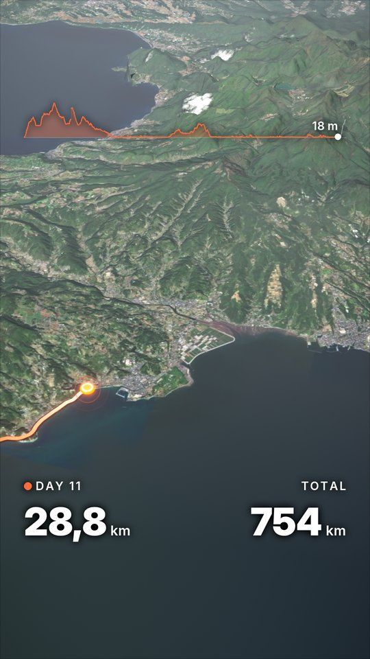
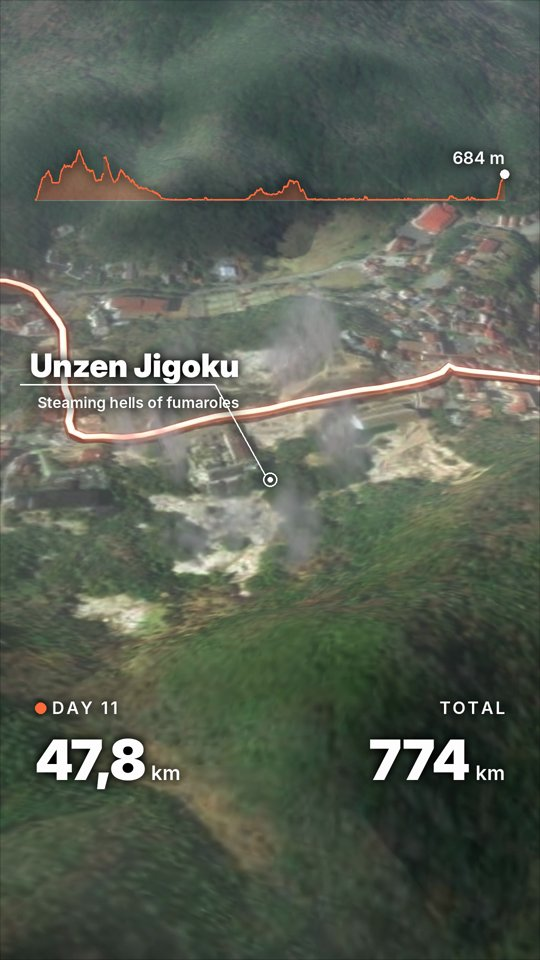
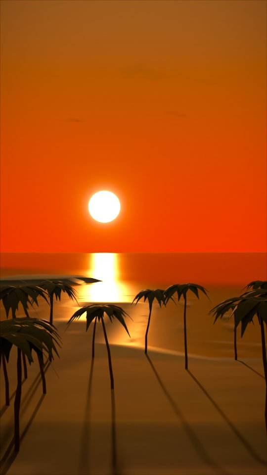

# gpx2reel

Turns the GPS tracks of a multi-day ride or hike into a vertical 3D map video for Reels and Stories.
Despite the name, GPX is just one input: it reads FIT files from bike computers and watches, Garmin Connect
"Export Original" ZIPs and GPX exports from apps such as Komoot — mixed in one folder.

<p>
  
  
  
</p>

Point it at a trip folder: it splits the tracks into days by local date,
drops duplicate recordings of the same ride (watch + bike computer + app) and stitches what one device missed.
A short YAML config says what to show — highlights, places, how to cross gaps. A marker then rides the route
over real terrain and satellite imagery under the real sun, rendered with Blender Cycles into a 1080×1920 video.

## Examples

Day stories from [examples/kyushu-2026](examples/kyushu-2026/README.md), 720p previews; full-size renders are in
the [release](https://github.com/unintended/gpx2reel/releases/tag/example-kyushu-2026).

Day 10 — sunset closing on a beach:

https://github.com/user-attachments/assets/b0d4f093-dcc7-4037-b068-8fdd478c33bf

Day 11 — a ferry inside the day, Unzen fumaroles, the climb counter:

https://github.com/user-attachments/assets/f521c68b-3a3c-4760-98dd-b6aca018e5a6

Day 12 — the last day and the finale zooming out to Japan:

https://github.com/user-attachments/assets/74215001-65db-4fd4-ae5e-6fa83a8d8aa1

## Features

- **Look:** satellite, stylized (land-cover palette with 3D trees, roads, rivers) or hybrid terrain; the sun
  from the actual date, time and place, with dusk, night and dawn between days; clouds with shadows, haze,
  bloom, contrast and vignette.
- **Camera:** intro zoom from country to route, a chase camera with slow drift, orbits around highlights,
  a finale that zooms back out.
- **Route:** band, ribbon or tube trail; puck or marker; one colour or one per day; gaps joined on the
  ground, driven along roads (OSRM), crossed by ferry or drawn as an arc.
- **Scenes:** sunrise openings (also on a beach with palms and surf), sunset closings, steam plumes and
  fumarole fields at highlights, a high-resolution terrain patch around them.
- **Overlays:** day and total km, elevation profile, climb counter, day cards, place labels, highlight
  callouts, trip totals; English or Russian.
- **Day stories:** one short film per day, with the days before already drawn; consecutive stories chain into
  one seamless film.

## Quickstart

Needs Python 3.13 (the `bpy` 5.2 wheel is cp313 only), [uv](https://docs.astral.sh/uv/) and `ffmpeg`. On a
headless Linux box `bpy` also needs `libgl1`, `libxi6`, `libxkbcommon0`, `libsm6`.

```bash
uv venv -p 3.13 .venv
uv pip install -e ".[blender,stylized,dev]"
.venv/bin/gpx2reel ingest examples/kyushu-2026
```

The full run on the bundled 12-day trip is in [examples/kyushu-2026](examples/kyushu-2026/README.md).

## Trip folder

One folder per trip: tracks in `tracks/`, the config in `track.yaml`, finished videos in `videos/`, everything
intermediate in `.work/track/` (safe to delete). Inputs are never written to; paths in the config are relative
to the folder; tiles and OSM extracts are cached in `~/.cache/gpx2reel/`. Full spec:
[docs/trip-layout.md](docs/trip-layout.md).

## Docs

- [docs/configuration.md](docs/configuration.md) — `track.yaml` by topic, the commands and their outputs
- [docs/trip-layout.md](docs/trip-layout.md) — the trip folder
- [CLAUDE.md](CLAUDE.md) — developer guide: pipeline, internals, pitfalls
- `gpx2reel presets` — every name a config may use; `--json` adds the full config schema

## Working with Claude Code

The tool is designed to be driven from a [Claude Code](https://claude.com/claude-code) session: the bundled
skill [`.claude/skills/gpx-reel`](.claude/skills/gpx-reel/SKILL.md) reads the trip, picks highlights and
places, writes `track.yaml`, takes your edits and runs the pipeline. Everything also works as a plain CLI.

## Data sources and attribution

Videos made with this tool show third-party data. Check each provider's terms before publishing.

| Data | Source | Terms |
|---|---|---|
| Satellite imagery | Esri World Imagery tiles | Esri terms of use; attribution required |
| Elevation | Terrarium tiles on AWS Open Data (Mapzen) | [Terrain Tiles attribution](https://github.com/tilezen/joerd/blob/master/docs/attribution.md) |
| Coastline, places, roads, rivers, buildings | OpenStreetMap via Overpass API and Geofabrik extracts | [ODbL](https://www.openstreetmap.org/copyright) |
| Driving routes for `road` gaps | OSRM demo server | [demo server policy](https://github.com/Project-OSRM/osrm-backend/wiki/Demo-server): light, non-commercial use |
| Land cover (stylized / hybrid) | ESA WorldCover 10 m 2021 v200 | [CC BY 4.0](https://esa-worldcover.org/en/data-access) |

Overpass, the OSRM demo server and Geofabrik are free community services: results are cached, keep the
request volume low. `style.credits` (on by default) prints the attribution under the outro and on covers.

## License

GPL-3.0-or-later (it links Blender's `bpy`, which is GPL). See [LICENSE](LICENSE).
