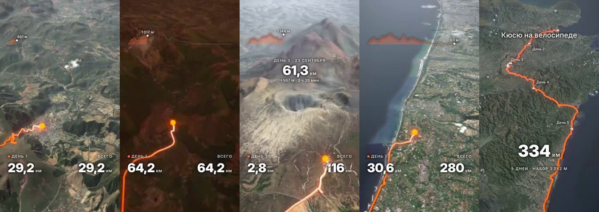
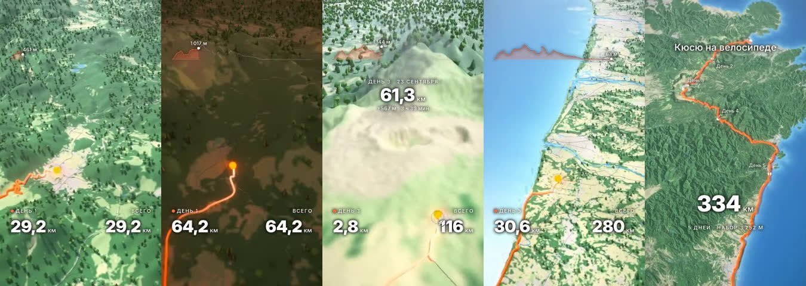
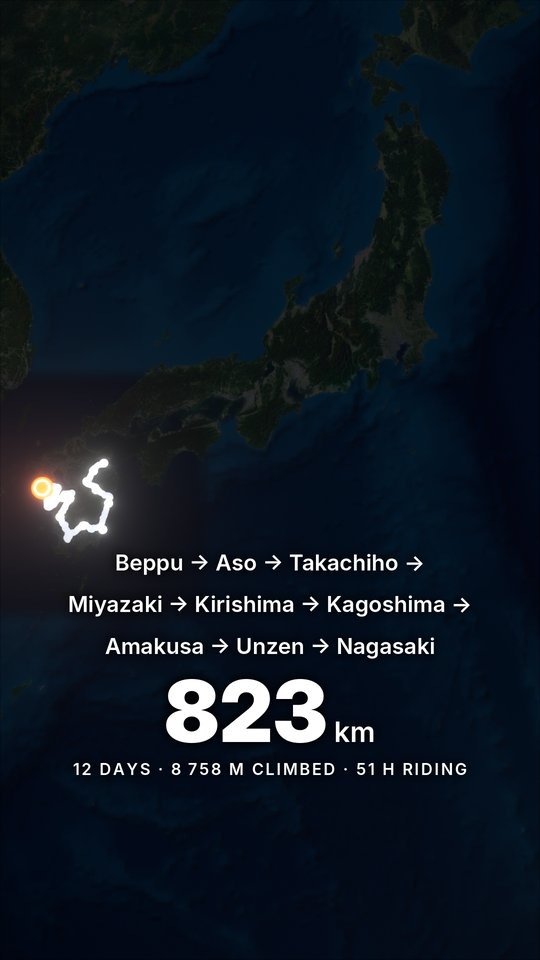
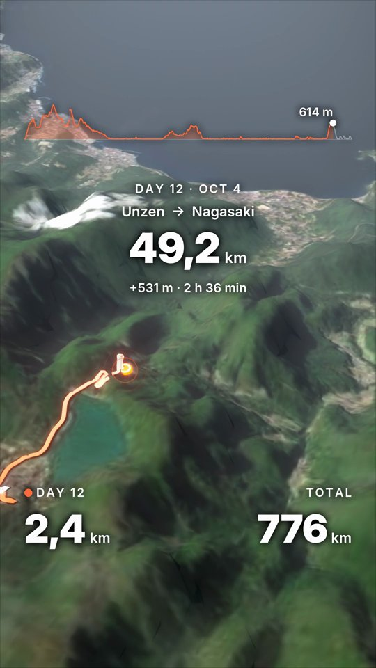
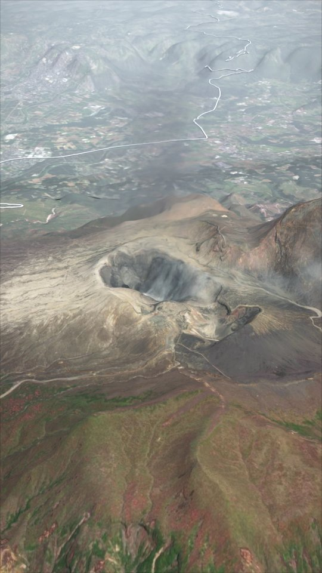

# Configuring a film

`track.yaml` in the trip folder describes one film. This guide explains the ideas by topic; the exhaustive
list of fields with defaults and limits is the schema itself:

```bash
gpx2reel presets          # every name a field may take (cameras, gap modes, label kinds …)
gpx2reel presets --json   # the same + the full track.yaml schema with a description of every field
gpx2reel validate <trip>  # checks the config against the route and prints the seconds each day gets
```

Start from `gpx2reel skeleton <trip>` (after `ingest`) or from
[the example](../examples/kyushu-2026/track.yaml). Only `title` is required; everything else has a default.
Day numbers, km and gaps are the ones `gpx2reel ingest` / `summary` print.

## Format, length and pacing

```yaml
title: ""                  # big text over the intro; "" for none
platform: instagram_reels  # caps duration_s: instagram_story 60 s, reels 180 s
duration_s: 90
pacing: mixed              # seconds per day ∝ km | √km (mixed) | equal (even)
fps: 30
```

The video is 1080×1920 by default. Intro, outro, highlights, openings, closings, gaps and nights get fixed
time; the rest is split between the days by `pacing`, at least 3 s each. `mixed` keeps a 30 km day and a
100 km day comparable on long trips. Pin a day with `days[].duration_s`. Within a day, climbs take longer
than descents (`style.climb_weight`, 0 = even speed). When the fixed shots don't leave 3 s per day,
`validate` says how many seconds the film needs.

## Style

### Terrain

```yaml
style:
  terrain: satellite   # satellite | stylized | hybrid
  exaggeration: 1.6    # vertical exaggeration
```

- `satellite` — Esri World Imagery draped over the elevation model.
- `stylized` — a map-like land-cover palette (ESA WorldCover) with 3D trees, roads and rivers from
  OpenStreetMap.
- `hybrid` — satellite imagery with the same 3D trees, roads and rivers.

`stylized` and `hybrid` need two more downloads before `scene`: `gpx2reel landcover <trip>` and
`gpx2reel osm <trip>` (the `stylized` install extra; the OSM extract can be several GB).




### Route, trail and marker

```yaml
style:
  color_mode: per_day          # single (style.color) | per_day (style.day_colors)
  day_colors: ["#FFD23F", "#FF9F1C", "#FF6B3D", "#F2385A"]
  trail: band                  # band | ribbon | tube
  ahead: hidden                # hidden | faint: show the route still to come
avatar:
  model: puck                  # puck | marker | procedural:grizl (a bicycle; reads poorly from far away)
```

The trail keeps its on-screen width as the camera moves; its newest stretch glows hotter. Legs travelled by
road or ferry are drawn in a lighter colour than the ridden ones.

### Light and grade

```yaml
style:
  day_night: true      # the real sun for each frame's date, time and place
  night_s: 1.2         # dusk → night → dawn between days
  clouds: 0.45         # cumulus coverage with shadows, cleared around highlights
  haze: 0.6            # aerial perspective on distant terrain
  bloom: 0.8           # glow around the trail and marker
  contrast: 0.5
  vignette: 0.4
  sun_disc: natural    # natural | hinomaru (the red disc of the Japanese flag) for sunrises and sunsets
```

With `day_night`, each ride runs on its own clock, so a morning start is lit low from the east. Rest days
between rides pass as a single night.

### Text

```yaml
style:
  language: en         # en | ru: day cards, counters, captions
  text_style: bold_minimal
  credits: true        # data attribution under the outro and on covers
```

Keep `credits` on when you publish: the imagery, elevation and OSM terms require attribution (see the
README). Overlays stay inside the Instagram safe zones.

## Intro and outro

```yaml
intro:
  duration_s: 6
  zoom:                              # widest first; ends on the route overview
    - {extent_km: 2400, center: [36.5, 137.5], label: Japan}
    - {extent_km: 420, center: [32.6, 131.0], label: Kyushu}
outro:
  duration_s: 7
  show_totals: true                  # km, climb, days, riding time
  zoom_out: true                     # back out through intro.zoom and hold
  route_points: [Beppu, Aso, Kagoshima, Nagasaki]   # "Beppu → Aso → …" under the route
```

`terrain` downloads a coarse context layer for each zoom stage. Without `zoom` the intro is an overview of the
route.



## Days

```yaml
days:
  - day: 6
    start: Aoshima                   # day card: "Aoshima → Miike Lake"
    finish: Miike Lake               # where the night after was spent
    camera: chase                    # chase | drone
    opening: sunrise_beach
    opening_s: 6
  - day: 10
    finish: Shimoda Onsen
    closing: sunset
    closing_s: 5
    closing_at: [32.3799, 129.9945]  # a better sunset spot than the finish
```

Days not listed use the defaults. The chase camera follows the marker from behind, its distance keyed to how
fast the route moves on screen, swinging slowly from side to side for parallax.

Keep `start` / `finish` to one or two words (a town or a landmark): they share one line on the day card.
`caption` replaces the "Day N" pin label; `note` adds a line under the finish in the outro.



### Sunrise opening

`opening: sunrise` puts a low camera behind the day's start, facing the sun as it rises, before the ride
begins. `sunrise_beach` does it on the shore: palms along the coast, houses from OSM, surf. `opening_caption`
and `opening_note` add a caption and a big line above it.

### Sunset closing

`closing: sunset` time-lapses to the evening after the ride: the camera stands over the water near the finish
while the sun goes down behind the sea or a ridge. `closing_at: [lat, lon]` moves it to a nicer beach: the
camera flies there and stands low behind palms. The spot must be within the downloaded terrain — `terrain`
widens the area for it, so run `terrain` after adding it.

Both scenes need a coastline. `terrain` downloads a detailed patch, the coastline and buildings for each one.

## Gaps

`ingest` lists the gaps between and within days: overnight hops, missing track, transfers. Each one is shown
the way its entry says; gaps without an entry are joined on the ground (an arc for long transfers).

```yaml
gaps:
  - after_day: 2
    mode: road                       # driven along roads (OSRM), in the transfer colour
    duration_s: 1.5
  - after_day: 7
    mode: straight                   # a dashed arc over the terrain
    caption: "Train transfer · 240 km"
  - after_day: 11
    within_day: true                 # a gap inside day 11, not after it
    mode: ferry                      # a straight line over the water
```

Modes: `join` (the marker rides across), `road`, `ferry`, `straight`, `skip` (cut).

## Highlights

A highlight pauses the ride at a km and flies the camera around a place, with a callout naming it.

```yaml
highlights:
  - poi: Mt Aso                      # the callout's name
    caption: Active volcano          # its second line
    at_km: 111.4                     # where the ride pauses (gpx2reel poi prints the km)
    duration_s: 4.5
    camera: orbit
    lat: 32.8847                     # the place itself
    lon: 131.0861
    detail: high_res_dem             # a 10×10 km patch at ~2 m/px imagery around lat / lon
    effects: [steam_plume]           # or fumaroles: a field of small wisps
  - poi: Unzen Jigoku
    at_km: 756.1
    duration_s: 4.5
    lat: 32.7405
    lon: 130.2630
    effects: [fumaroles]
    orbit_km: 1.2                    # orbit radius; default 4 km
    orbit_pitch_deg: 45              # look down steeper so a close orbit clears the hills
```

The orbit is centred on `lat` / `lon` (the marker's position without them). Effects and the detail patch need
the coordinates too. Clouds clear around highlights. `material_preset` is accepted but not rendered yet
(`gpx2reel presets` marks every planned value).

 

## Labels

Places named on the map as the camera passes them. `gpx2reel poi <trip>` lists ranked candidates from OSM —
peaks and volcanoes near the route, towns, lakes, waterfalls, viewpoints, sights — with coordinates.

```yaml
labels:
  - {name: Kuju, lat: 33.0822, lon: 131.2409, kind: peak, ele: 1786}   # "Kuju · 1786 m" on a stick
  - {name: Takachiho Gorge, lat: 32.7021, lon: 131.3016, kind: sight}
  - {name: Minamata, lat: 32.2123, lon: 130.4088, kind: town}
```

Kinds: `peak`, `town`, `waterfall`, `lake`, `wetland`, `viewpoint`, `sight`. When labels collide, the earlier
one in the list wins. Labels hide while the camera sweeps fast so they don't flicker. Names over 20 characters
don't fit and `validate` warns.

## Music

```yaml
music: music/track.mp3     # relative to the trip folder
```

Mixed into the final and draft videos with fades. Without it the video is silent.

## Day stories

A day story is a short film of one day: the days before it already drawn, the day itself ridden up close.

```bash
gpx2reel day-story <trip> --day 5
gpx2reel render <trip> --story day05 --draft
```

`day-story` writes the story's own config into `.work/track/stories/day05/track.yaml`, derived from the main
one: `focus_day: 5`, no nights, the intro zoom only on day 1, the length from `--duration` (20 s). Edit that
file and re-run `gpx2reel timeline <trip> --story day05` to change it. Highlights, labels, openings and
closings of that day carry over.

By default stories chain (`story_chain`): each ends at night on the whole route ridden so far, and the next
one starts on that exact frame, so posted one after another they play as one film. `--standalone` builds
`day05-standalone` instead, `--suffix x` a variant `day05-x` to compare.

## Commands

Every command takes the trip folder. Per-film commands also take `--story <name>` to work on a day story
instead of the main reel. `--help` on any command lists all its options.

| Command | What it does |
|---|---|
| `ingest` | Read the tracks: days, de-duplication, cleaning, gaps, stats, a preview map |
| `summary` | Print the trip summary again |
| `skeleton` | Write a minimal `track.yaml` for the route |
| `validate` | Check `track.yaml` against the route; print the seconds per day |
| `presets` | Every name a config may use (`--json`: + the schema) |
| `terrain` | Download elevation, imagery, coastline, highlight and beach patches, zoom layers |
| `poi` | Label candidates from OSM along the route |
| `landcover`, `osm` | Land cover and OSM roads / rivers for `stylized` / `hybrid` |
| `scene` | Build the 3D scene (`--still`: overview stills) |
| `timeline` | Animate camera, marker and trail from the config (`--stills N`: N preview frames) |
| `overlays` | Only the text and graphics layer, without Blender |
| `render` | Frames + overlays → video |
| `cover` | One full-size frame with overlays (`--t` seconds; default: the outro) |
| `day-story` | Build a day story (`--day`, `--duration`, `--standalone`, `--suffix`) |
| `stories` | List the day stories |
| `sanitize` | Shareable tracks: one plain GPX per day (`--out`, `--tolerance-m`, `--trim-m`) |
| `compare`, `profile` | Engine comparison and per-frame timing (development) |

`render` options worth knowing:

- `--draft` — 25 % size, 8 samples, into `videos/drafts/`; minutes instead of hours.
- `--frames N` — render only ~N frames spread over the film, encoded at the same length (choppy, fast).
- `--reuse-frames` — keep the rendered frames, redo only overlays and encoding (after a text change).
- `--redo 12-15,40-41` — re-render only the frames in these seconds.
- `--jobs N` — split frames between N Blender processes (default 4 for drafts on ≥ 32 cores).
- `--engine cycles|eevee` — EEVEE needs a GPU; the default is Cycles.
- `--tag x` — a variant: `frames-x/` and `track-<name>-x.mp4`, without overwriting the main render.

A changed config needs `timeline` again (and `scene` when the terrain, trail, marker, effects or highlights'
places changed), then `render`.

## Outputs

| Path | What |
|---|---|
| `videos/track-reel.mp4` | the main film; `track-day05.mp4` a day story |
| `videos/track-<name>-cover.png` | cover |
| `videos/drafts/track-<name>.mp4` | drafts |
| `.work/track/build/` | the main film's state: `route.json`, `preview.png`, `poi.json`, `terrain/`, `scene.blend`, `reel.blend`, `frames/`, `draft/`, `overlay/` |
| `.work/track/stories/<name>/` | a day story: `track.yaml`, `tracks/` (links), `build/` |
| `~/.cache/gpx2reel/` | map tiles and OSM extracts shared by all trips |

Everything under `.work/` can be deleted; it is rebuilt by re-running the commands.
